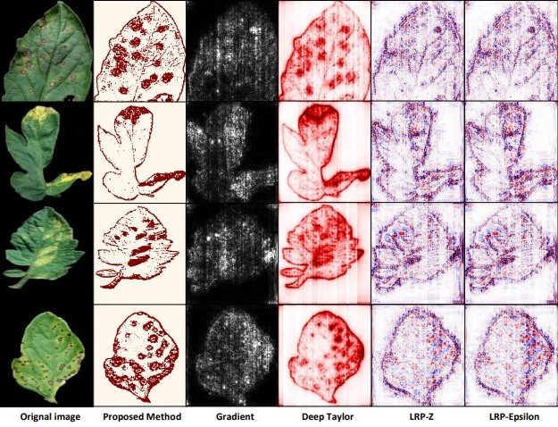
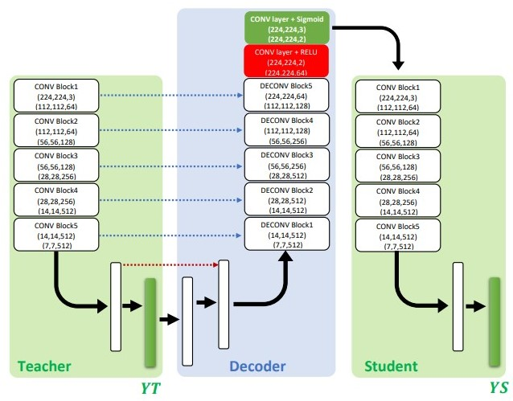

# Plant-Disease-Classification
## Classification of plant diseases using Convolutional neural networks

* The model is built based on Teacher-Student Architecture, Which consists of three classifier Teacher, Decoder and Student Classifier
* Teacher and Student classifiers use VGG-16 Architecture which are loaded with the weights of the model trained on Image Net Dataset(Which is known as Transfer Learning).
* The above model provides a better visual view of the infected parts of plants, Which can be seen in the below image

* The output from the Teacher classifier is used as input for the decode classifier whose output is the visual view shown above, Later this image is used as input for the student classifier for training.

